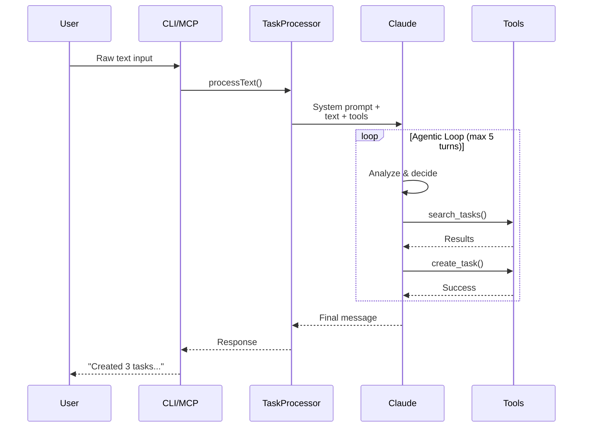

# Agentic Task Processing

## Overview

The **Task Processor Agent** is an AI-powered system that intelligently processes raw text input (task lists, natural language, commands) and autonomously decides what actions to take. Unlike traditional parsing, this uses Claude AI with **tool access** to reason about your intent and execute the right operations.

## How It Works

```
You paste text → AI Agent analyzes → AI uses tools → Reports back
```

The AI has access to these tools:
- `search_tasks` - Find existing tasks
- `create_task` - Create new tasks
- `update_task` - Update existing tasks
- `complete_task` - Mark tasks complete
- `list_tasks` - View current tasks

The AI **reasons** about what to do:
1. Searches for duplicates before creating
2. Asks clarifying questions if ambiguous
3. Updates existing tasks instead of creating duplicates
4. Batches operations efficiently
5. Reports back conversationally

## Usage

### CLI

```bash
# From a file
pnpm run cli process-text --file tasks.txt

# Direct text
pnpm run cli process-text --text "- buy groceries
- call dentist
- finish presentation"

# From stdin (paste and press Ctrl+D)
pnpm run cli process-text
```

### MCP (Cursor Integration)

In Cursor, just paste your task list and say:

**"Process these tasks:"**
```
- Buy groceries
- Fix the kitchen sink
- Email John about the meeting
```

Or natural language:
- "I need to call Sarah, reply to that email, and finish my presentation"
- "Add tasks for: grocery shopping, dentist appointment, and review budget"

The AI assistant will use the `process_text_agent` tool automatically.

## Examples

### Example 1: Simple Task List

**Input:**
```
- Buy groceries
- Call dentist for appointment
- Review Q4 budget proposal
```

**Agent Actions:**
1. `search_tasks("groceries")` → No matches
2. `search_tasks("dentist")` → No matches  
3. `search_tasks("budget")` → No matches
4. `create_task({content: "Buy groceries"})`
5. `create_task({content: "Call dentist for appointment"})`
6. `create_task({content: "Review Q4 budget proposal"})`

**Response:**
```
✅ I've successfully created three tasks for you:
1. "Buy groceries"
2. "Call dentist for appointment"  
3. "Review Q4 budget proposal"

(Processed in 4 AI turn(s))
```

### Example 2: Duplicate Detection

**Input:**
```
- Fix the kitchen sink
- Repair dishwasher
```

**Existing Task:** "Repair kitchen sink" (created last week)

**Agent Actions:**
1. `search_tasks("kitchen sink")` → Found existing task
2. AI decides: This is similar to existing task

**Response:**
```
I found an existing task "Repair kitchen sink". 
Would you like me to:
1. Update the existing task
2. Create a new separate task for the sink
3. Skip this one

Also creating "Repair dishwasher"...
```

### Example 3: Natural Language

**Input:**
```
I need to send an email to John about the Q3 results,
call the vendor about the invoice, and buy supplies
for the office kitchen
```

**Agent Actions:**
1. Identifies 3 separate tasks
2. Searches for duplicates
3. Creates formatted tasks:
   - "Email John about Q3 results"
   - "Call vendor about invoice"
   - "Buy office kitchen supplies"

**Response:**
```
✅ Created 3 tasks from your note:
1. Email John about Q3 results
2. Call vendor about invoice
3. Buy office kitchen supplies
```

### Example 4: Mixed Commands

**Input:**
```
- New task: Buy birthday present for Sarah
- Mark the vendor task as done
- Update my presentation task to high priority
```

**Agent Actions:**
1. `create_task` for birthday present
2. `search_tasks("vendor")` → Find task
3. `complete_task(vendorTaskId)`
4. `search_tasks("presentation")` → Find task
5. `update_task(presentationTaskId, {priority: 4})`

**Response:**
```
✅ Done:
- Created "Buy birthday present for Sarah"
- Marked "Vendor registration" as complete
- Updated "Finish presentation" to high priority
```

## Supported Formats

The AI can understand:

### Markdown Lists
```markdown
- Task one
- Task two
* Task three
+ Task four
```

### Numbered Lists
```markdown
1. First task
2. Second task
3. Third task
```

### Checkbox Lists
```markdown
- [ ] Incomplete task
- [x] Completed task (will mark complete)
```

### Plain Text
```
Buy groceries
Call dentist
Fix sink
```

### Natural Language
```
I need to email John, call the vendor,
and review the budget before Friday
```

### Mixed Commands
```
- Create: Buy birthday present
- Complete: vendor registration task
- Update: meeting task to high priority
```

## AI Capabilities

The agent is smart enough to:

### 1. Detect Duplicates
- Searches before creating
- Compares similarity
- Asks if you want to update vs. create new

### 2. Parse Context
- Extracts multiple tasks from prose
- Identifies priorities ("urgent", "high priority")
- Recognizes completion requests ("mark X as done")

### 3. Ask Questions
- "I found 2 tasks about vendors. Which one?"
- "Should I update the existing task or create a new one?"
- "What priority should this have?"

### 4. Batch Efficiently
- Creates multiple tasks in one go
- Processes updates together
- Reports comprehensive summary

### 5. Learn Your Patterns
- Understands your task naming style
- Recognizes recurring tasks
- Adapts to your workflow

## Technical Architecture



### Key Components

1. **TaskProcessorAgent** (`src/ai/task-processor.js`)
   - Manages Claude conversation
   - Executes tool calls
   - Handles multi-turn reasoning

2. **System Prompt**
   - Instructs AI on task management
   - Provides tool descriptions
   - Sets behavior guidelines

3. **Tool Handlers**
   - `search_tasks` - Query local storage
   - `create_task` - Create in Todoist
   - `update_task` - Update existing
   - `complete_task` - Mark done
   - `list_tasks` - View current

4. **CLI Command** (`process-text`)
   - File input (`--file`)
   - Direct text (`--text`)
   - Stdin (interactive paste)

5. **MCP Tool** (`process_text_agent`)
   - Exposed to Cursor
   - Natural language interface
   - Conversational responses

## Cost & Performance

- **Model**: Claude 3.5 Sonnet (for reasoning)
- **Typical Cost**: ~$0.01 per batch of 5-10 tasks
- **Speed**: 2-5 AI turns, ~5-15 seconds
- **Efficiency**: Searches before creating (avoids duplicates)

## Benefits vs. Traditional Parsing

| Traditional Parsing | Agentic Processing |
|---------------------|-------------------|
| Rigid format requirements | Flexible, any format |
| No duplicate detection | Smart duplicate checking |
| Can't ask questions | Asks for clarification |
| Simple pattern matching | Understands context |
| Breaks on edge cases | Handles ambiguity |
| No learning | Adapts to your style |

## Limitations

1. **Max 5 AI Turns**: Prevents infinite loops
2. **No File Attachments**: Text only
3. **Sequential Processing**: One task list at a time
4. **API Cost**: Uses Claude (though cheap)

## Future Enhancements

- [ ] Learn from past processing sessions
- [ ] Extract due dates from natural language ("tomorrow", "next Friday")
- [ ] Auto-categorize new tasks
- [ ] Suggest time estimates
- [ ] Batch email-to-task conversion
- [ ] Voice input support
- [ ] Multi-language support
- [ ] Project/section assignment

## Best Practices

### ✅ Do

- Paste freely - any format works
- Use natural language
- Let AI ask questions if ambiguous
- Review AI's interpretation
- Provide context when needed

### ❌ Don't

- Don't worry about perfect formatting
- Don't create tasks manually if you have a list
- Don't duplicate-check yourself (AI does it)
- Don't over-specify (AI figures it out)

## Troubleshooting

### "No input provided"
- Make sure text isn't empty
- Check file path if using `--file`

### "Reached max turns"
- AI couldn't complete in 5 turns
- Tasks might still be partially created
- Try breaking into smaller batches

### "Tool X failed"
- Check API keys (Todoist, Claude)
- Verify network connection
- Check error message for details

### Tasks not showing in list
- Run `pnpm run cli sync` to fetch from Todoist
- Local cache updates on next sync
- Tasks are in Todoist even if not cached yet

## Example Workflows

### Morning Planning
```bash
# Paste your day's tasks
echo "- Email John
- Review budget
- Call dentist
- Buy groceries" | pnpm run cli process-text
```

### Email to Tasks
Copy from email, then:
```bash
pnpm run cli process-text --text "Follow up on:
- Vendor proposal
- Client feedback  
- Team meeting agenda"
```

### Meeting Notes to Tasks
After a meeting:
```bash
pnpm run cli process-text --file meeting-notes.md
```

### Voice Note Transcription
Use voice-to-text, then:
```bash
pnpm run cli process-text --text "$(pbpaste)"
```

---

**The agentic approach makes task management truly conversational and intelligent!** 🤖✨

