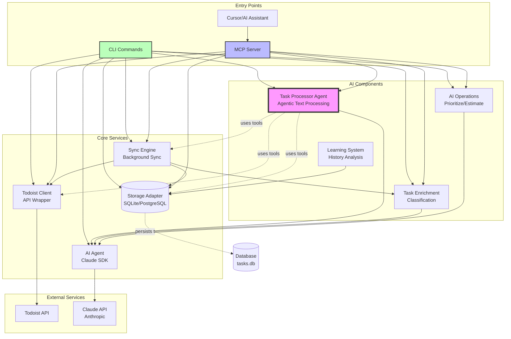
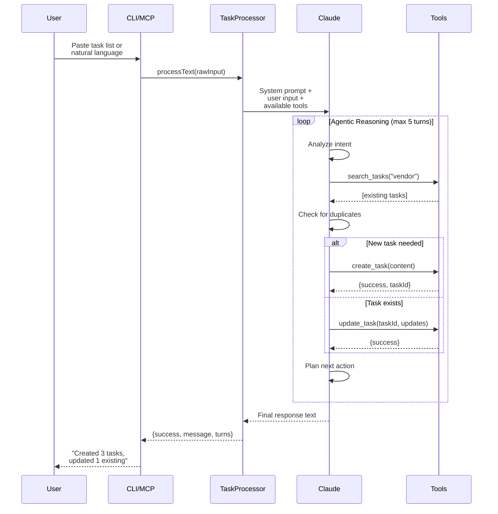
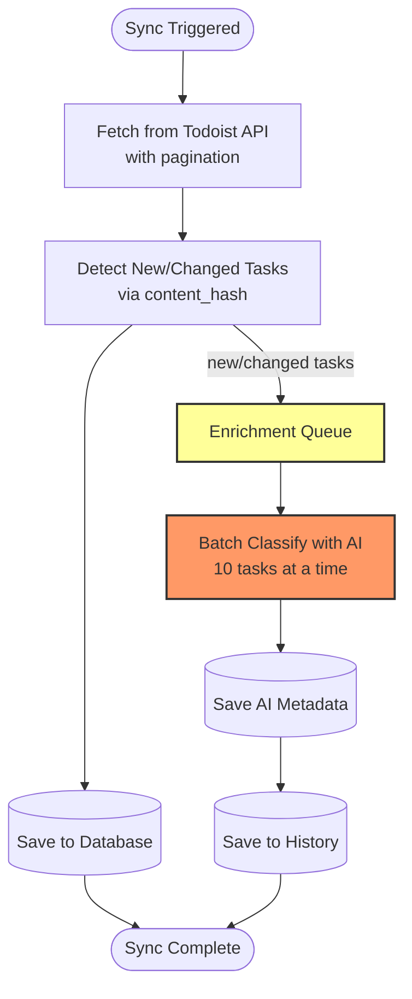
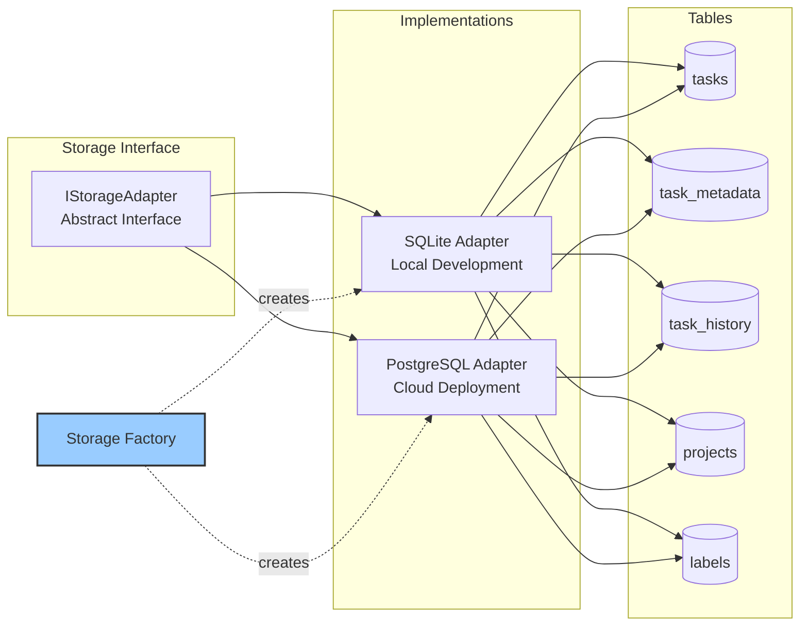

# System Architecture

## Overview Diagram



## CLI Command Architecture

```mermaid
graph LR
    subgraph "Task Management"
        sync[sync]
        list[list]
        inbox[inbox]
        complete[complete]
        completed[completed]
    end

    subgraph "AI Operations"
        classify[classify]
        prioritize[prioritize]
        plan[plan]
        search[search]
        breakdown[breakdown]
    end

    subgraph "Analytics"
        productivity[productivity]
        stats[stats]
        insights[insights]
    end

    subgraph "Meta Commands"
        processText[process-text]
        models[models]
    end

    sync --> SyncEngine
    list --> Storage
    inbox --> Storage
    complete --> |fuzzy search| Storage
    complete --> SyncEngine
    completed --> Storage
    productivity --> Storage

    classify --> Enrichment
    prioritize --> AIOperations
    plan --> AIOperations
    search --> AIOperations
    breakdown --> AIOperations

    stats --> Enrichment
    insights --> AIOperations

    processText --> TaskProcessor
    models --> AIAgent

    TaskProcessor -.agentic flow.-> |creates/updates/completes| SyncEngine
```

## MCP Tools Architecture

```mermaid
graph TB
    subgraph "Cursor Integration"
        CursorChat[Cursor Chat]
        CursorAgent[AI Assistant]
    end

    subgraph "MCP Server Tools"
        direction TB
        
        subgraph "Task Tools"
            t1[list_todoist_tasks]
            t2[get_todoist_task]
            t3[sync_todoist]
            t4[update_task]
            t5[complete_task]
            t6[complete_task_by_search]
        end

        subgraph "AI Tools"
            a1[ai_classify_tasks]
            a2[ai_prioritize]
            a3[ai_estimate_time]
            a4[ai_daily_plan]
            a5[ai_breakdown_task]
            a6[ai_search_tasks]
        end

        subgraph "Analytics Tools"
            s1[get_task_history]
            s2[get_recently_completed]
            s3[get_productivity_stats]
            s4[get_insights]
            s5[get_stats]
        end

        subgraph "Meta Tools"
            m1[process_text_agent]
        end
    end

    subgraph "Backend"
        Services[Core Services]
        TaskProcessorAgent[Task Processor Agent<br/>Agentic AI]
    end

    CursorChat --> CursorAgent
    CursorAgent --> |MCP protocol| MCP

    t1 & t2 & t3 & t4 & t5 & t6 --> Services
    a1 & a2 & a3 & a4 & a5 & a6 --> Services
    s1 & s2 & s3 & s4 & s5 --> Services
    m1 --> TaskProcessorAgent

    TaskProcessorAgent -.recursive tool use.-> t1 & t2 & t3 & t4 & t5

    style m1 fill:#f9f,stroke:#333,stroke-width:4px
    style TaskProcessorAgent fill:#f9f,stroke:#333,stroke-width:4px
```



## Task Processor Agent Flow (NEW!)



## Data Flow: Sync & Enrichment



## Storage Layer



## Component Responsibilities

| Component | Responsibility | Key Methods |
|-----------|---------------|-------------|
| **CLI** | User interface, command parsing | All `program.command()` definitions |
| **MCP Server** | Tool exposure for AI assistants | `ListToolsRequestSchema`, `CallToolRequestSchema` |
| **Storage Adapter** | Database abstraction | `getTasks()`, `saveTasks()`, `updateTask()` |
| **Todoist Client** | API communication | `getTasks()`, `createTask()`, `closeTask()` |
| **Sync Engine** | Background sync, change detection | `syncNow()`, `completeTask()` |
| **AI Agent** | Claude SDK wrapper | `query()`, streaming |
| **Task Enrichment** | AI classification | `classifyTask()`, batch processing |
| **AI Operations** | High-level AI ops | `prioritizeTasks()`, `generateInsights()` |
| **Task Processor** | Agentic text processing (NEW!) | `processText()`, tool execution |

## Key Features by Layer

### Entry Layer (CLI/MCP)
- ✅ 20+ CLI commands
- ✅ 15+ MCP tools
- ✅ Fuzzy search completion
- ✅ Natural language processing via Task Processor Agent

### Service Layer
- ✅ Cloud-ready storage abstraction
- ✅ Todoist pagination (359 tasks)
- ✅ Background sync with change detection
- ✅ Content hashing for cost optimization

### AI Layer
- ✅ Batch classification (10 tasks/batch)
- ✅ Prioritization with reasoning
- ✅ Time estimation learning
- ✅ Agentic task processor with tool use

### Data Layer
- ✅ SQLite for local development
- ✅ PostgreSQL ready for cloud
- ✅ Task history for learning
- ✅ Metadata enrichment

## Request Flow Examples

### Example 1: CLI Task Completion
```
User: pnpm run cli complete "vendor" --time 15
  ↓
CLI: Parse args, init services
  ↓
Storage: Fuzzy search "vendor" → 1 match
  ↓
Sync: completeTask(taskId, {actualDuration: 15})
  ↓
Todoist API: closeTask(taskId)
  ↓
Storage: saveTaskCompletion(taskId, metadata)
  ↓
CLI: Display "✅ Task completed"
```

### Example 2: MCP Tool Call
```
Cursor: "Complete the vendor task"
  ↓
MCP Server: complete_task_by_search({searchTerm: "vendor"})
  ↓
Storage: Search & find task
  ↓
Sync: completeTask(taskId)
  ↓
MCP: Return {success: true, taskContent: "..."}
  ↓
Cursor: Shows response to user
```

### Example 3: Agentic Text Processing (NEW!)
```
User: Paste "- buy groceries\n- fix sink\n- email John"
  ↓
CLI: process-text command
  ↓
Task Processor Agent: processText(rawInput)
  ↓
Claude: Receives system prompt + tools
  ↓
Claude: search_tasks("groceries") → none found
  ↓
Claude: create_task({content: "buy groceries"})
  ↓
Claude: search_tasks("sink") → found "repair kitchen sink"
  ↓
Claude: Ask user: "Update existing 'repair kitchen sink' or create new?"
  ↓
[continues agentic loop until done]
  ↓
Task Processor: Returns conversational summary
  ↓
CLI: Display result
```

## Technology Stack

- **Runtime**: Node.js v22+
- **Package Manager**: pnpm
- **AI**: Claude (Anthropic) - Haiku 3/3.5, Sonnet 3.5
- **Database**: SQLite (local), PostgreSQL (cloud)
- **Task Service**: Todoist API v2
- **Integration**: MCP (Model Context Protocol)
- **CLI Framework**: Commander.js

## Deployment Targets

| Environment | Storage | Sync | AI | Access |
|-------------|---------|------|-----|--------|
| **Local Dev** | SQLite | Manual/Interval | Claude API | CLI + MCP |
| **Cloud (GCP)** | Cloud SQL (Postgres) | Cloud Scheduler | Claude API | MCP Server |
| **Cursor** | Remote MCP | On-demand | Claude API | Chat Interface |

---

**Key Insight**: The system is designed as a **layered architecture** where:
1. **Entry points** (CLI/MCP) are thin wrappers
2. **Services** handle business logic
3. **AI components** are composable and tool-enabled
4. **Storage** is abstracted for cloud deployment
5. **Task Processor Agent** provides agentic capabilities via recursive tool use

