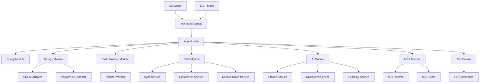

# Architecture Documentation

## Overview

This document describes the architecture of the Todoist AI Agent NestJS implementation, including design patterns, module structure, data flow, and key decisions.

## Table of Contents

- [High-Level Architecture](#high-level-architecture)
- [Module Structure](#module-structure)
- [Design Patterns](#design-patterns)
- [Data Flow](#data-flow)
- [Key Components](#key-components)
- [Interface Abstractions](#interface-abstractions)
- [Dependency Injection](#dependency-injection)
- [Testing Strategy](#testing-strategy)
- [Deployment Architecture](#deployment-architecture)

## High-Level Architecture



## Module Structure

### 1. Configuration Module

**Purpose**: Centralized configuration and environment validation

**Components**:
- `ConfigModule` - NestJS configuration
- `EnvSchema` - Environment variable validation (class-validator)
- `TaxonomyService` - Task taxonomy loader (YAML)

**Exports**: ConfigService (globally available)

```typescript
@Global()
@Module({
  imports: [
    ConfigModule.forRoot({
      validate: (config) => validateEnv(config),
    }),
  ],
  providers: [TaxonomyService],
  exports: [TaxonomyService],
})
export class ConfigurationModule {}
```

### 2. Storage Module

**Purpose**: Database abstraction layer

**Components**:
- `IStorageAdapter` - Interface for storage operations
- `SQLiteAdapter` - SQLite implementation
- `PostgresAdapter` - PostgreSQL implementation
- Factory provider for adapter selection

**Design**: Factory pattern + Interface abstraction

```typescript
@Global()
@Module({
  providers: [
    {
      provide: 'IStorageAdapter',
      useFactory: (config: ConfigService) => {
        const type = config.get('DATABASE_TYPE');
        return type === 'postgres' 
          ? new PostgresAdapter(config.get('DATABASE_URL'))
          : new SQLiteAdapter(config.get('DATABASE_URL'));
      },
      inject: [ConfigService],
    },
  ],
  exports: ['IStorageAdapter'],
})
export class StorageModule {}
```

### 3. Task Provider Module

**Purpose**: Abstract external task management APIs

**Components**:
- `ITaskProvider` - Interface for task providers
- `TodoistProvider` - Todoist API implementation
- `TodoistClient` - API client wrapper

**Design**: Strategy pattern for swappable providers

```typescript
@Global()
@Module({
  providers: [
    {
      provide: 'ITaskProvider',
      useClass: TodoistProvider,
    },
    TodoistClient,
  ],
  exports: ['ITaskProvider'],
})
export class TaskProviderModule {}
```

### 4. Task Module

**Purpose**: Core task management business logic

**Components**:
- `SyncService` - Sync with external provider
- `EnrichmentService` - Apply metadata to tasks
- `ReconciliationService` - Detect conflicts

**Dependencies**: IStorageAdapter, ITaskProvider

**DTOs**: TaskDto, SyncDto, EnrichmentDto

```typescript
@Module({
  imports: [StorageModule, TaskProviderModule, ConfigurationModule],
  providers: [SyncService, EnrichmentService, ReconciliationService],
  exports: [SyncService, EnrichmentService, ReconciliationService],
})
export class TaskModule {}
```

### 5. AI Module

**Purpose**: AI-powered operations using Claude

**Components**:
- `ClaudeService` - Anthropic API wrapper
- `AIOperationsService` - High-level AI operations
- `LearningService` - Pattern analysis
- `PromptsService` - Centralized prompts

**Dependencies**: IStorageAdapter, ClaudeService

**DTOs**: ClassificationDto, TimeEstimateDto, PrioritizationDto

```typescript
@Module({
  imports: [StorageModule, ConfigurationModule],
  providers: [
    ClaudeService,
    AIOperationsService,
    LearningService,
    PromptsService,
  ],
  exports: [ClaudeService, AIOperationsService, LearningService],
})
export class AIModule {}
```

### 6. MCP Module

**Purpose**: Model Context Protocol server

**Components**:
- `MCPServerService` - MCP server implementation
- `@MCPTool()` - Decorator for tool classes
- `@MCPToolHandler()` - Decorator for tool methods
- Tool classes (TaskTools, AITools, AgentTools)

**Design**: Decorator-based tool discovery

```typescript
@Module({
  imports: [StorageModule, TaskProviderModule, TaskModule, AIModule],
  providers: [
    MCPServerService,
    TaskTools,
    AITools,
    ProcessTextAgentTool,
    {
      provide: 'MCPServerService',
      useExisting: MCPServerService,
    },
  ],
  exports: [MCPServerService],
})
export class MCPModule {}
```

**Tool Discovery**:
```typescript
@Injectable()
@MCPTool()
export class TaskTools {
  @MCPToolHandler({
    name: 'list_todoist_tasks',
    description: 'List tasks',
    inputSchema: ListTasksDto,
  })
  async listTasks(@Args('filters') filters: TaskFilters) {
    return this.storage.getTasks(filters);
  }
}
```

### 7. CLI Module

**Purpose**: Command-line interface

**Components**:
- Command classes using nestjs-commander
- Decorators: `@Command()`, `@Option()`, `@Argument()`

**Design**: Decorator-based command registration

```typescript
@Module({
  imports: [
    CommandModule,
    TaskModule,
    AIModule,
    StorageModule,
    TaskProviderModule,
  ],
  providers: [
    SyncCommand,
    ListCommand,
    ClassifyCommand,
    PrioritizeCommand,
    CompleteCommand,
    PlanCommand,
    InsightsCommand,
  ],
})
export class CLIModule {}
```

**Command Example**:
```typescript
@Command({ name: 'sync', description: 'Sync with Todoist' })
export class SyncCommand extends CommandRunner {
  constructor(private syncService: SyncService) {
    super();
  }

  async run() {
    const result = await this.syncService.syncNow();
    console.log(`Synced ${result.tasks} tasks`);
  }

  @Option({ flags: '-f, --full', description: 'Full resync' })
  parseFullOption(): boolean {
    return true;
  }
}
```

## Design Patterns

### 1. Dependency Injection

**All components use constructor injection**:

```typescript
@Injectable()
export class SyncService {
  constructor(
    @Inject('ITaskProvider') private taskProvider: ITaskProvider,
    @Inject('IStorageAdapter') private storage: IStorageAdapter,
    private reconciliation: ReconciliationService,
  ) {}
}
```

**Benefits**:
- Easy testing (inject mocks)
- Loose coupling
- Clear dependencies

### 2. Interface Abstraction

**Key Interfaces**:

```typescript
// Storage abstraction
export abstract class IStorageAdapter {
  abstract getTasks(filters?: TaskFilters): Promise<Task[]>;
  abstract saveTaskMetadata(taskId: string, metadata: TaskMetadata): Promise<void>;
  // ... other methods
}

// Task provider abstraction
export interface ITaskProvider {
  getTasks(filters?: TaskFilters): Promise<Task[]>;
  createTask(data: CreateTaskDto): Promise<Task>;
  updateTask(taskId: string, updates: UpdateTaskDto): Promise<Task>;
  // ... other methods
}
```

**Benefits**:
- Swappable implementations
- Easy mocking
- Database independence
- Provider independence (Todoist → Trello → Asana)

### 3. Factory Pattern

**Storage adapter selection**:

```typescript
{
  provide: 'IStorageAdapter',
  useFactory: (config: ConfigService) => {
    const type = config.get('DATABASE_TYPE');
    switch (type) {
      case 'postgres':
        return new PostgresAdapter(config.get('DATABASE_URL'));
      case 'sqlite':
      default:
        return new SQLiteAdapter(config.get('DATABASE_URL'));
    }
  },
  inject: [ConfigService],
}
```

### 4. Strategy Pattern

**AI operations as strategies**:

```typescript
export class AIOperationsService {
  async classifyTasks(tasks: Task[]): Promise<ClassificationResult[]> {
    // Classification strategy
  }

  async estimateTaskDuration(task: Task): Promise<TimeEstimate> {
    // Time estimation strategy
  }

  async prioritizeTasks(tasks: Task[]): Promise<Prioritization> {
    // Prioritization strategy
  }
}
```

### 5. Decorator Pattern

**MCP tools and CLI commands**:

```typescript
@MCPToolHandler({
  name: 'ai_classify_tasks',
  description: 'Classify tasks',
  inputSchema: ClassifyDto,
})
async classifyTasks(@Args('taskIds') taskIds: string[]) {
  // Implementation
}
```

### 6. Repository Pattern

**Data access layer**:

```typescript
// IStorageAdapter acts as repository
interface IStorageAdapter {
  // CRUD operations
  getTasks(filters?: TaskFilters): Promise<Task[]>;
  getTask(taskId: string): Promise<Task | null>;
  saveTask(task: Task): Promise<void>;
  
  // Queries
  queryTasksByMetadata(criteria: Partial<TaskMetadata>): Promise<Task[]>;
  getTasksByCategory(category: string): Promise<Task[]>;
}
```

## Data Flow

### Sync Flow

```
1. User runs: node dist/main sync
2. CLIModule → SyncCommand
3. SyncCommand → SyncService.syncNow()
4. SyncService → ITaskProvider.getTasks() [Todoist]
5. SyncService → ReconciliationService.detectChanges()
6. SyncService → IStorageAdapter.saveTasks()
7. Return sync summary
```

### AI Classification Flow

```
1. User runs: node dist/main classify
2. CLIModule → ClassifyCommand
3. ClassifyCommand → EnrichmentService.getUnclassifiedTasks()
4. EnrichmentService → IStorageAdapter.getTasks({ category: null })
5. ClassifyCommand → AIOperationsService.classifyTasks()
6. AIOperationsService → ClaudeService.query()
7. AIOperationsService → Parse response
8. EnrichmentService → enrichTask() for each
9. EnrichmentService → IStorageAdapter.saveTaskMetadata()
10. Return classification results
```

### MCP Tool Call Flow

```
1. AI agent calls MCP tool: list_todoist_tasks
2. MCPServerService receives request
3. MCPServerService → Finds registered tool handler
4. Execute: TaskTools.listTasks()
5. TaskTools → IStorageAdapter.getTasks()
6. Format response as MCP result
7. Return to AI agent
```

## Key Components

### Bootstrap (main.ts)

```typescript
async function bootstrap() {
  const runMode = process.env.RUN_MODE || 'cli';
  
  if (runMode === 'mcp') {
    // MCP Server mode
    const app = await NestFactory.createApplicationContext(AppModule);
    const mcpServer = app.get('MCPServerService');
    await mcpServer.start();
  } else {
    // CLI mode
    await CommandFactory.run(AppModule);
  }
}
```

**Decision Logic**:
- `RUN_MODE=mcp` → Start MCP server (stdio)
- `RUN_MODE=cli` → Run CLI command
- Default → CLI mode

### Config Validation

```typescript
export class EnvironmentVariables {
  @IsString()
  TODOIST_API_KEY: string;

  @IsString()
  CLAUDE_API_KEY: string;

  @IsEnum(['sqlite', 'postgres'])
  DATABASE_TYPE: 'sqlite' | 'postgres';

  @IsString()
  DATABASE_URL: string;

  @IsOptional()
  @IsInt()
  SYNC_INTERVAL?: number;
}
```

**Validation happens at startup** - app won't start with invalid config.

### Task Taxonomy

**YAML Structure**:
```yaml
work:
  color: blue
  projects:
    - Work Tasks
  
home-maintenance:
  color: green
  projects:
    - Home Maintenance
```

**Loaded at startup** by `TaxonomyService`.

## Interface Abstractions

### IStorageAdapter

**Why?**
- Database independence
- Easy to add new databases (MongoDB, DynamoDB)
- Testing with in-memory mock

**Implementations**:
1. SQLiteAdapter - Local development
2. PostgresAdapter - Production
3. MockStorageAdapter - Testing

### ITaskProvider

**Why?**
- Provider independence
- Easy to add new providers (Trello, Asana, Linear)
- Testing with mock provider

**Implementations**:
1. TodoistProvider - Current
2. Future: TrelloProvider, AsanaProvider
3. MockTaskProvider - Testing

## Dependency Injection

### Global Modules

These modules are available everywhere:

```typescript
@Global()
@Module({...})
export class ConfigurationModule {}

@Global()
@Module({...})
export class StorageModule {}

@Global()
@Module({...})
export class TaskProviderModule {}
```

### Injection Tokens

```typescript
// String tokens for interfaces
@Inject('IStorageAdapter') private storage: IStorageAdapter
@Inject('ITaskProvider') private taskProvider: ITaskProvider

// Class tokens for concrete classes
constructor(private syncService: SyncService) {}
```

## Testing Strategy

### Unit Tests

**Test in isolation with mocks**:

```typescript
describe('SyncService', () => {
  let service: SyncService;
  let storage: MockStorageAdapter;
  let taskProvider: MockTaskProvider;

  beforeEach(async () => {
    const module = await Test.createTestingModule({
      providers: [
        SyncService,
        {
          provide: 'IStorageAdapter',
          useClass: MockStorageAdapter,
        },
        {
          provide: 'ITaskProvider',
          useClass: MockTaskProvider,
        },
      ],
    }).compile();

    service = module.get(SyncService);
    storage = module.get('IStorageAdapter');
    taskProvider = module.get('ITaskProvider');
  });

  it('should sync tasks', async () => {
    taskProvider.seedTasks([mockTask]);
    await service.syncNow();
    expect(storage.getTasks()).toHaveLength(1);
  });
});
```

### Integration Tests

**Test module boundaries**:

```typescript
describe('TaskModule Integration', () => {
  // Real storage (test DB)
  // Mocked task provider
  // Test full sync → enrich → classify flow
});
```

### E2E Tests

**Test complete workflows**:

```typescript
describe('CLI E2E', () => {
  it('should sync and classify tasks', async () => {
    // Run: node dist/main sync
    // Run: node dist/main classify
    // Verify results
  });
});
```

## Deployment Architecture

### Docker

**Multi-stage build**:
1. `deps` - Install dependencies
2. `builder` - Build TypeScript
3. `runner` - Minimal runtime image

**Image size**: ~200MB (optimized)

### Production Modes

**1. MCP Server (Long-running)**:
```yaml
services:
  mcp-server:
    environment:
      - RUN_MODE=mcp
    restart: unless-stopped
```

**2. CLI (One-off commands)**:
```yaml
services:
  cli:
    environment:
      - RUN_MODE=cli
    command: ["node", "dist/main", "sync"]
    profiles: [cli]
```

### Cloud Deployment

**GCP Cloud Run**:
- Serverless container platform
- Auto-scaling
- Neon PostgreSQL for database

**AWS ECS/Fargate**:
- Container orchestration
- RDS PostgreSQL

## Performance Considerations

### Database

- **SQLite**: Fast for local, single-user
- **PostgreSQL**: Better for concurrent access
- **Connection pooling**: 10 connections max
- **Indexes**: On `category`, `priority`, `completed_at`

### AI Operations

- **Batch processing**: Classify multiple tasks at once
- **Rate limiting**: Respect Claude API limits
- **Caching**: Cache taxonomy and config

### Memory

- **Lazy loading**: Only load needed modules
- **Streaming**: For large result sets
- **Cleanup**: Close DB connections properly

## Security

### API Keys

- **Never in code**: Use environment variables
- **Never in logs**: Masked in error messages
- **Docker secrets**: Use for production

### Database

- **Parameterized queries**: Prevent SQL injection
- **Read-only user**: For analytics
- **Encrypted connections**: Use SSL for PostgreSQL

### Container

- **Non-root user**: App runs as `nestjs:nodejs`
- **Minimal image**: Alpine Linux base
- **Security scanning**: Automated with CI/CD

## Monitoring & Observability

### Logging

- **Structured logging**: JSON format
- **Log levels**: ERROR, WARN, INFO, DEBUG
- **Context**: Include request IDs, user IDs

### Health Checks

```typescript
@Controller('health')
export class HealthController {
  @Get()
  check() {
    return { status: 'ok' };
  }

  @Get('db')
  async checkDatabase() {
    // Test DB connection
  }

  @Get('todoist')
  async checkTodoist() {
    // Test Todoist API
  }
}
```

### Metrics

- **Task counts**: Total, by category, by status
- **Sync duration**: Track sync performance
- **AI usage**: Token counts, API calls
- **Errors**: Track and alert on failures

## Future Enhancements

### Planned Features

1. **GraphQL API** - Alternative to MCP
2. **WebSocket support** - Real-time updates
3. **Multi-tenant** - Support multiple users
4. **Caching layer** - Redis for performance
5. **Event sourcing** - Audit trail for changes

### Extensibility Points

1. **New providers** - Implement `ITaskProvider`
2. **New databases** - Implement `IStorageAdapter`
3. **New AI models** - Swap Claude for GPT-4, etc.
4. **New MCP tools** - Add `@MCPToolHandler` decorators
5. **New CLI commands** - Add `@Command` classes

---

**Questions?** See [README.md](./README.md) or [CONTRIBUTING.md](./CONTRIBUTING.md)

